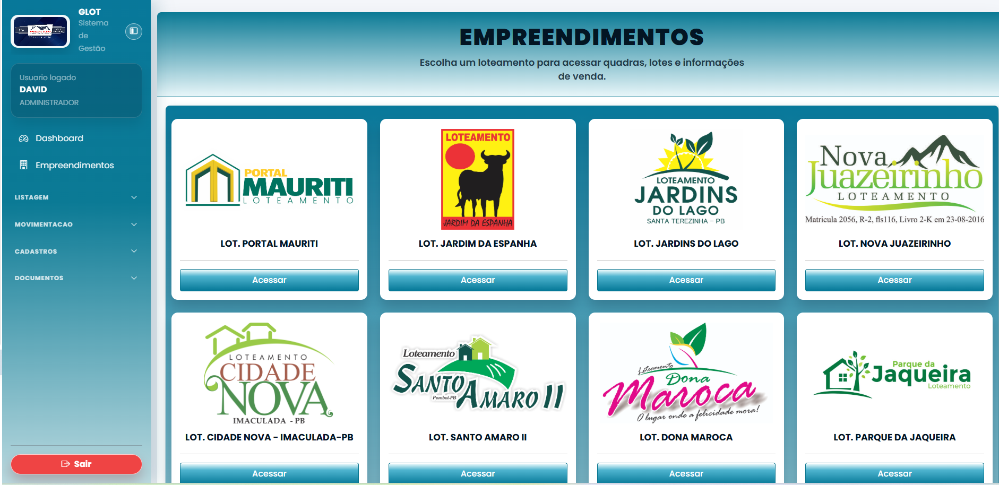
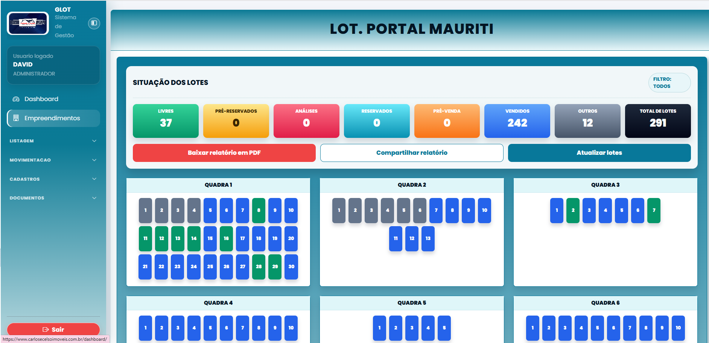
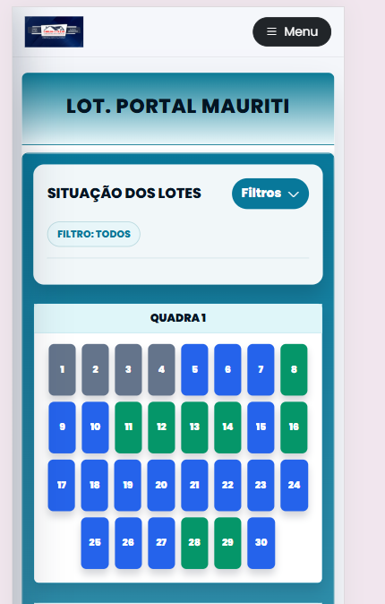

# GLOT — Sistema de Gestão de Loteamentos

Sistema ERP desenvolvido em Django para gestão completa de loteamentos e vendas de terrenos, incluindo controle de empreendimentos, clientes, documentos e fluxo de vendas.

> Sistema em produção desde 2024, gerenciando mais de 8.000 lotes distribuídos em 11 empreendimentos.

---

## Screenshots

### Empreendimentos


### Mapa de Lotes


### Responsivo (Mobile)


---

## Funcionalidades

- **Empreendimentos** — cadastro e gestão de loteamentos com mapa visual de quadras e lotes por status (livre, reservado, vendido, bloqueado)
- **Vendas** — fluxo completo `ANÁLISE → RESERVADO → PRÉ-VENDA → VENDIDO` com histórico e cancelamento
- **Clientes** — cadastro PF/PJ com wizard de 6 etapas, upload de documentos e validação de CPF/CNPJ
- **Documentos** — geração de propostas e contratos em PDF com editor TipTap (A4 paginado), geração travada por etapa de venda
- **Dashboard** — visão geral de lotes por status, últimas vendas e resumo por empreendimento
- **Cobrança** — controle de parcelas e vencimentos
- **Mensageria** — envio de comunicados via WhatsApp (Evolution API)
- **Controle de acesso** — sistema de permissões com 3 perfis (Administrador, Corretor, Proprietário) e 24 permissões granulares

---

## Stack

| Camada | Tecnologia |
|---|---|
| Backend | Python 3.12, Django 5 |
| Banco de dados | PostgreSQL 17 |
| Fila de tarefas | Celery + RabbitMQ |
| Cache | Redis |
| Armazenamento | Backblaze B2 |
| PDF | Playwright (Chromium headless) |
| Frontend | Tailwind CSS, Alpine.js |
| Infra | Docker Swarm, Nginx, Cloudflare |
| CI/CD | GitHub Actions + Portainer API |

---

## Arquitetura

```
glot/
├── accounts/          # Autenticação, perfis e permissões
├── base/              # Configurações globais e utilitários
├── clientes/          # Cadastro PF/PJ, documentos, wizard
├── cobranca/          # Parcelas e vencimentos
├── dashboard/         # Visão geral e relatórios
├── documentos/        # Geração de PDF (proposta/contrato)
├── empreendimentos/   # Loteamentos, quadras e lotes
├── mensagem/          # WhatsApp via Evolution API
├── vendas/            # Fluxo de vendas e histórico
├── core/              # Settings, URLs, WSGI
├── docker/            # Entrypoint e configs de container
└── .github/workflows/ # CI/CD pipeline
```

---

## Como rodar localmente

### Pré-requisitos

- Docker e Docker Compose
- Python 3.12+

### Setup

```bash
# Clone o repositório
git clone https://github.com/davidnobreg/Prod_glot.git
cd Prod_glot

# Copie e configure as variáveis de ambiente
cp .env.example .env
# Edite o .env com suas configurações

# Suba os serviços
docker compose up -d

# Rode as migrations
docker compose exec web python manage.py migrate

# Crie um superusuário
docker compose exec web python manage.py createsuperuser
```

Acesse em `http://localhost:8000`

---

## Deploy

O deploy em produção é automatizado via GitHub Actions:

```
push → main
  → Build da imagem Docker (linux/amd64 + linux/arm64)
  → Push para Docker Hub
  → Redeploy via Portainer API (Docker Swarm)
```

---

## Testes

```bash
# Rodar todos os testes
python manage.py test

# App específico
python manage.py test apps.vendas -v 2
```

---

## Licença

MIT License — veja [LICENSE](LICENSE) para detalhes.

---

Desenvolvido por [David Nóbrega](https://github.com/davidnobreg) · [DN Software](https://dnsoftware.com.br)
